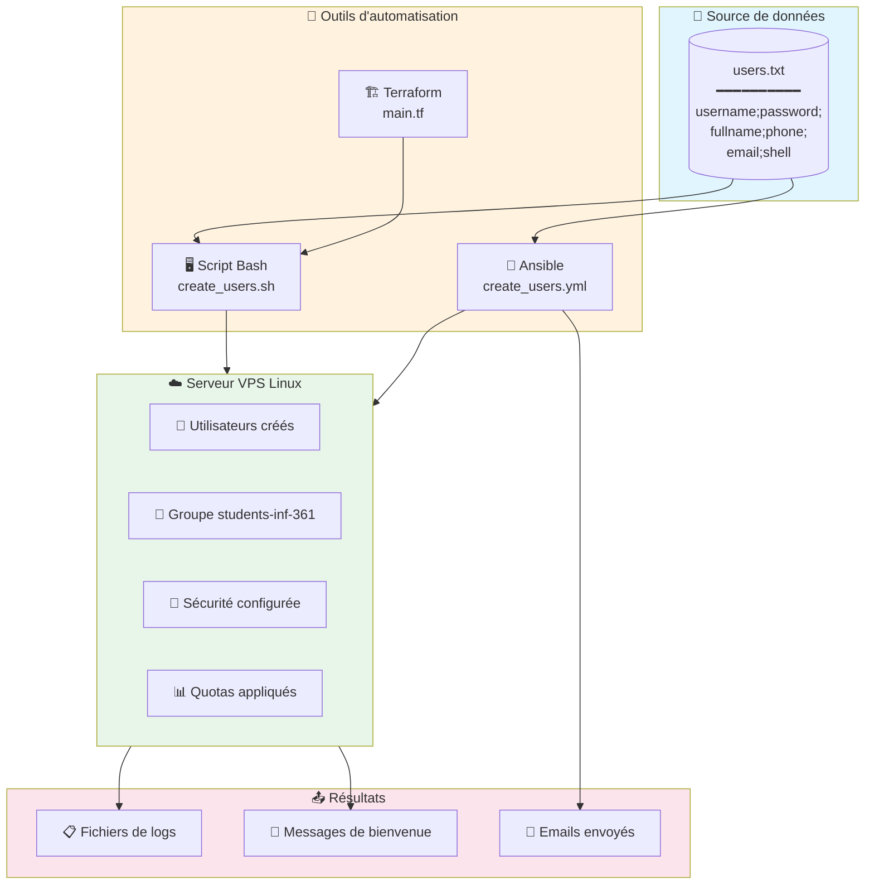
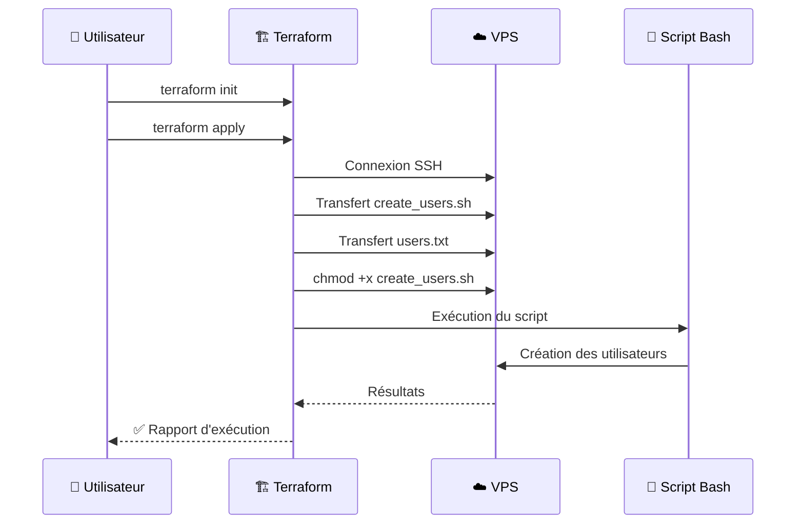
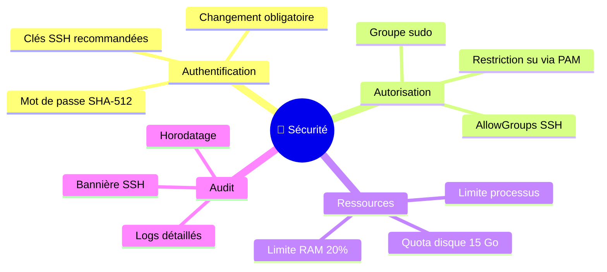

<<<<<<< HEAD
# Secure_vps
Comment securiser son VPS de facon  complete avec un script bash une playbook ansible ou terraform
=======
<div align="center">

# 🖥️ TP1 - Automatisation de la Création d'Utilisateurs Linux


[](https://www.uy1.uninet.cm/)
[](#)
[](#)

**Administration Systèmes et Réseaux - Université de Yaoundé I**

---

### 👨‍🎓 Informations de l'étudiant

| Champ | Valeur |
|:------|:-------|
| **Nom complet** | AZAB A RANGA FRANCK MIGUEL |
| **Matricule** | 23V2227 |
| **Filière** | Informatique - Licence 3 |
| **Cours** | INF 3611 |
| **Date** | 01 Décembre 2025 |

</div>

---

## 📋 Table des matières

- [🎯 Objectif du projet](#-objectif-du-projet)
- [🏗️ Architecture du projet](#️-architecture-du-projet)
- [📁 Structure des fichiers](#-structure-des-fichiers)
- [🔧 Prérequis](#-prérequis)
- [📖 Partie 0 : Sécurité SSH](#-partie-0--sécurité-ssh)
- [💻 Partie 1 : Script Bash](#-partie-1--script-bash)
- [🤖 Partie 2 : Playbook Ansible](#-partie-2--playbook-ansible)
- [🏗️ Partie 3 : Terraform](#️-partie-3--terraform)
- [📄 Format du fichier users.txt](#-format-du-fichier-userstxt)
- [📊 Tableau de conformité](#-tableau-de-conformité)
- [🔐 Sécurité](#-sécurité)

---

## 🎯 Objectif du projet

Ce projet automatise la création de comptes utilisateurs sur un VPS Linux, permettant de :

- ✅ Créer automatiquement des utilisateurs depuis un fichier `users.txt`
- ✅ Configurer les shells, mots de passe (SHA-512) et répertoires personnels
- ✅ Appliquer des quotas disque (15 Go) et limites mémoire (20% RAM)
- ✅ Renforcer la sécurité SSH du serveur
- ✅ Envoyer des emails de bienvenue automatiques (Ansible)

---

## 🏗️ Architecture du projet



---

## 📁 Structure des fichiers

```
📦 TP-INF3611-Securite-VPS/
├── 📄 README.md                          # Documentation principale
├── 📄 .gitignore                         # Fichiers ignorés par Git
│
├── 📂 Partie0-SSH/                       # Documentation et script sécurité SSH
│   ├── 📄 README.md                      # Procédures et paramètres
│   └── 📄 configure_ssh.sh               # Script de durcissement SSH
│
├── 📂 Partie1-Bash/                      # Script Bash
│   ├── 📄 README.md                      # Documentation du script
│   ├── 📄 create_users.sh                # Script principal
│   └── 📄 users.txt                      # Fichier source utilisateurs
│
├── 📂 Partie2-Ansible/                   # Playbook Ansible
│   ├── 📄 README.md                      # Documentation Ansible
│   ├── 📄 create_users.yml               # Playbook principal
│   ├── 📄 inventory.ini                  # Inventaire des serveurs
│   ├── 📄 ansible.cfg                    # Configuration Ansible
│   ├── 📄 users.txt                      # Fichier source utilisateurs
│   └── 📂 templates/
│       └── 📄 welcome.txt.j2             # Template message bienvenue
│
└── 📂 Partie3-Terraform/                 # Infrastructure as Code
    ├── 📄 README.md                      # Documentation Terraform
    ├── 📄 main.tf                        # Configuration principale
    ├── 📄 variables.tf                   # Définition des variables
    ├── 📄 outputs.tf                     # Sorties Terraform
    └── 📄 terraform.tfvars.example       # Exemple de configuration
```

---

## 🔧 Prérequis

### Système cible (VPS)
- 🐧 Linux (Ubuntu 20.04+ / Debian 11+ recommandé)
- 🔑 Accès root ou sudo
- 🌐 Connexion Internet

### Outils requis sur la machine de contrôle

| Outil | Version | Installation Ubuntu/Debian |
|-------|---------|---------------------------|
| Git | 2.x+ | `sudo apt install git` |
| Bash | 4.x+ | Pré-installé |
| Ansible | 2.9+ | `sudo apt install ansible` |
| Terraform | 1.0+ | Voir ci-dessous |

### Installation de Terraform

```bash
# Télécharger et installer Terraform
wget -O- https://apt.releases.hashicorp.com/gpg | sudo gpg --dearmor -o /usr/share/keyrings/hashicorp-archive-keyring.gpg
echo "deb [signed-by=/usr/share/keyrings/hashicorp-archive-keyring.gpg] https://apt.releases.hashicorp.com $(lsb_release -cs) main" | sudo tee /etc/apt/sources.list.d/hashicorp.list
sudo apt update && sudo apt install terraform

# Vérifier l'installation
terraform --version
```

---

## 📖 Partie 0 : Sécurité SSH

### 📍 Emplacement : `Partie0-SSH/`

### 🎯 Objectifs
1. Décrire la procédure de modification SSH
2. Expliquer le risque principal (lock-out)
3. Documenter 5 paramètres de sécurité avec justifications

### 📝 Contenu
- `README.md` : Documentation complète
- `configure_ssh.sh` : Script de durcissement automatique

### 🚀 Étapes d'exécution

```bash
# 1. Se placer dans le répertoire
cd Partie0-SSH

# 2. Lire la documentation
cat README.md

# 3. (Optionnel) Exécuter le script de durcissement SSH
chmod +x configure_ssh.sh
sudo ./configure_ssh.sh 2222 students-inf-361
# Arguments : [port_ssh] [groupe_autorisé]
```

### ⚠️ Avertissement

> **IMPORTANT** : Avant d'exécuter le script de configuration SSH, assurez-vous de :
> 1. Garder une session SSH ouverte
> 2. Avoir accès à une console de secours (KVM, IPMI, console cloud)
> 3. Tester la nouvelle connexion AVANT de fermer la session actuelle

### 🔐 Les 5 paramètres de sécurité

| # | Paramètre | Valeur | Justification |
|:-:|-----------|--------|---------------|
| 1 | `PermitRootLogin` | `no` | Empêche la connexion directe en root |
| 2 | `Port` | `2222` | Réduit les scans automatisés |
| 3 | `PasswordAuthentication` | `no` | Force l'auth par clé SSH |
| 4 | `MaxAuthTries` | `3` | Limite les tentatives |
| 5 | `AllowGroups` | `students-inf-361` | Restreint l'accès |

---

## 💻 Partie 1 : Script Bash

### 📍 Emplacement : `Partie1-Bash/`

### 🎯 Fonctionnalités implémentées

| # | Fonctionnalité | Implémentation |
|:-:|----------------|----------------|
| 1 | Groupe en paramètre | `$1` passé au script |
| 2a | Nom d'utilisateur | `useradd` |
| 2b | Nom, WhatsApp, email | Champ GECOS `-c` |
| 2c | Shell (vérif/install) | `check_and_install_shell()` |
| 2d | Répertoire personnel | `useradd -m` |
| 3 | Ajout au groupe | `usermod -aG` |
| 4 | MDP haché SHA-512 | `openssl passwd -6` |
| 5 | Forcer changement MDP | `chage -d 0` |
| 6 | Sudo + restriction su | `pam_wheel.so` |
| 7 | Message bienvenue | `WELCOME.txt` + `.bashrc` |
| 8 | Quota 15 Go | `setquota` |
| 9 | Limite RAM 20% | `/etc/security/limits.conf` |
| 10 | Fichier de logs | `user_creation_*.log` |

### 🚀 Étapes d'exécution

```bash
# 1. Se placer dans le répertoire
cd Partie1-Bash

# 2. Vérifier/modifier le fichier users.txt
cat users.txt
nano users.txt  # Si besoin de modifier

# 3. Rendre le script exécutable
chmod +x create_users.sh

# 4. Exécuter le script (en tant que root)
sudo ./create_users.sh students-inf-361

# 5. Vérifier les résultats
cat user_creation_*.log
getent group students-inf-361
```

### 📄 Exemple de fichier users.txt

```
# Format: username;password;full_name;phone;email;shell
jean.dupont;TempPass123!;Jean Dupont;+237699001122;jean.dupont@univ-yaounde1.cm;/bin/bash
marie.kamga;SecureP@ss456;Marie Kamga;+237677889900;marie.kamga@univ-yaounde1.cm;/bin/zsh
```

### 📋 Exemple de sortie

```
================================================================================
   SCRIPT DE CRÉATION D'UTILISATEURS - INF 3611
   Auteur: AZAB A RANGA FRANCK MIGUEL - 23V2227
================================================================================
[INFO] Création du groupe 'students-inf-361'...
[SUCCESS] Groupe 'students-inf-361' créé avec succès.
[INFO] Création de l'utilisateur: jean.dupont
[SUCCESS] Utilisateur 'jean.dupont' créé avec le shell '/bin/bash'.
[SUCCESS] Mot de passe haché SHA-512 configuré.
[SUCCESS] Changement de mot de passe obligatoire à la première connexion.
[SUCCESS] Message de bienvenue créé.
[SUCCESS] Quota de 15Go configuré.
[SUCCESS] Limites mémoire configurées (20% RAM).
================================================================================
SCRIPT TERMINÉ AVEC SUCCÈS
================================================================================
```

---

## 🤖 Partie 2 : Playbook Ansible

### 📍 Emplacement : `Partie2-Ansible/`

### 🎯 Fonctionnalités
- Toutes les fonctionnalités du script Bash
- **+ Chargement des utilisateurs depuis `users.txt`**
- **+ Envoi d'emails personnalisés**

### 📧 Contenu de l'email envoyé

L'email contient :
- ✅ Adresse IP du serveur
- ✅ Port SSH
- ✅ Nom d'utilisateur
- ✅ Mot de passe initial
- ✅ Commande SSH de connexion
- ✅ Commande `ssh-copy-id` (Linux/macOS/Windows)

### 🚀 Étapes d'exécution

```bash
# 1. Se placer dans le répertoire
cd Partie2-Ansible

# 2. Configurer l'inventaire avec l'IP de votre VPS
nano inventory.ini
```

**Contenu de `inventory.ini` :**
```ini
[vps_servers]
vps1 ansible_host=VOTRE_IP_VPS ansible_user=admin ansible_ssh_private_key_file=~/.ssh/id_rsa
```

```bash
# 3. Vérifier/modifier le fichier users.txt
cat users.txt
nano users.txt  # Si besoin

# 4. (Optionnel) Configurer l'envoi d'emails
nano create_users.yml
# Modifier : smtp_host, smtp_user, smtp_password

# 5. Tester la connectivité
ansible -i inventory.ini all -m ping

# 6. Exécuter le playbook (dry-run d'abord)
ansible-playbook -i inventory.ini create_users.yml --check

# 7. Exécuter le playbook (pour de vrai)
ansible-playbook -i inventory.ini create_users.yml

# 8. Vérifier les résultats sur le serveur
ssh admin@VOTRE_IP_VPS "getent group students-inf-361"
```

### 📋 Exemple de sortie Ansible

```
PLAY [Automatisation de la création d'utilisateurs sous Linux] *****************

TASK [Gathering Facts] **********************************************************
ok: [vps1]

TASK [Lecture du fichier users.txt] *********************************************
ok: [vps1 -> localhost]

TASK [Affichage des utilisateurs chargés] ***************************************
ok: [vps1] => {
    "msg": "5 utilisateur(s) chargé(s) depuis users.txt"
}

TASK [Création du groupe students-inf-361] **************************************
changed: [vps1]

TASK [Création des utilisateurs] ************************************************
changed: [vps1] => (item={'username': 'jean.dupont', ...})
changed: [vps1] => (item={'username': 'marie.kamga', ...})

TASK [Envoi de l'email de bienvenue à chaque utilisateur] ***********************
ok: [vps1] => (item={'username': 'jean.dupont', ...})
ok: [vps1] => (item={'username': 'marie.kamga', ...})

PLAY RECAP **********************************************************************
vps1 : ok=15   changed=8    unreachable=0    failed=0    skipped=0
```

---

## 🏗️ Partie 3 : Terraform

### 📍 Emplacement : `Partie3-Terraform/`

### 🎯 Objectif
Utiliser Terraform pour exécuter le script Bash de création d'utilisateurs sur le VPS.

### 🚀 Étapes d'exécution

```bash
# 1. Se placer dans le répertoire
cd Partie3-Terraform

# 2. Créer le fichier de configuration
cp terraform.tfvars.example terraform.tfvars

# 3. Modifier les variables
nano terraform.tfvars
```

**Contenu de `terraform.tfvars` :**
```hcl
server_ip            = "VOTRE_IP_VPS"
ssh_user             = "admin"
ssh_port             = 22
ssh_private_key_path = "~/.ssh/id_rsa"
group_name           = "students-inf-361"
```

```bash
# 4. Initialiser Terraform
terraform init

# 5. Prévisualiser les actions
terraform plan

# 6. Appliquer la configuration
terraform apply
# Taper 'yes' pour confirmer

# 7. Vérifier les outputs
terraform output

# 8. (Optionnel) Détruire les ressources locales
terraform destroy
```

### 📋 Workflow Terraform



---

## 📄 Format du fichier users.txt

### Structure

```
username;default_password;full_name;phone;email;preferred_shell
```

### Exemple complet

```bash
# Fichier users.txt - Utilisateurs pour le TP INF 3611
# Les lignes commençant par # sont ignorées

jean.dupont;TempPass123!;Jean Dupont;+237699001122;jean.dupont@univ-yaounde1.cm;/bin/bash
marie.kamga;SecureP@ss456;Marie Kamga;+237677889900;marie.kamga@univ-yaounde1.cm;/bin/zsh
paul.nguema;MyP@ssw0rd789;Paul Nguema;+237655443322;paul.nguema@univ-yaounde1.cm;/bin/bash
alice.mbarga;Str0ngP@ss!;Alice Mbarga;+237690112233;alice.mbarga@univ-yaounde1.cm;/bin/bash
bob.fouda;P@ssw0rd2025;Bob Fouda;+237688776655;bob.fouda@univ-yaounde1.cm;/usr/bin/fish
```

### Description des champs

| Champ | Description | Exemple |
|-------|-------------|---------|
| `username` | Nom d'utilisateur Linux | `jean.dupont` |
| `default_password` | Mot de passe initial | `TempPass123!` |
| `full_name` | Nom complet | `Jean Dupont` |
| `phone` | Numéro WhatsApp | `+237699001122` |
| `email` | Adresse email | `jean.dupont@univ-yaounde1.cm` |
| `preferred_shell` | Shell préféré | `/bin/bash`, `/bin/zsh`, `/usr/bin/fish` |

---

## 📊 Tableau de conformité

### Conformité aux exigences du TP

| # | Exigence du TP | Bash | Ansible | Terraform |
|:-:|----------------|:----:|:-------:|:---------:|
| **Partie 0** | | | | |
| 0.1 | Procédure modification SSH | ✅ | - | - |
| 0.2 | Risque principal | ✅ | - | - |
| 0.3 | 5 paramètres sécurité | ✅ | - | - |
| **Partie 1** | | | | |
| 1.1 | Groupe en paramètre | ✅ | ✅ | ✅ |
| 1.2 | Création utilisateur complète | ✅ | ✅ | ✅ |
| 1.3 | Shell vérifié/installé | ✅ | ✅ | ✅ |
| 1.4 | MDP haché SHA-512 | ✅ | ✅ | ✅ |
| 1.5 | Forcer changement MDP | ✅ | ✅ | ✅ |
| 1.6 | Sudo + restriction su | ✅ | ✅ | ✅ |
| 1.7 | Message bienvenue | ✅ | ✅ | ✅ |
| 1.8 | Quota 15 Go | ✅ | ✅ | ✅ |
| 1.9 | Limite RAM 20% | ✅ | ✅ | ✅ |
| 1.10 | Fichier de logs | ✅ | ✅ | ✅ |
| **Partie 2** | | | | |
| 2.1 | Chargement users.txt | ✅ | ✅ | ✅ |
| 2.2 | Email avec IP serveur | - | ✅ | - |
| 2.3 | Email avec port SSH | - | ✅ | - |
| 2.4 | Email avec username | - | ✅ | - |
| 2.5 | Email avec MDP initial | - | ✅ | - |
| 2.6 | Email avec cmd SSH | - | ✅ | - |
| 2.7 | Email avec ssh-copy-id | - | ✅ | - |
| **Partie 3** | | | | |
| 3.1 | Terraform exécute script | - | - | ✅ |
| 3.2 | main.tf | - | - | ✅ |
| 3.3 | variables.tf | - | - | ✅ |
| **Livrables** | | | | |
| L1 | create_users.sh | ✅ | - | - |
| L2 | create_users.yml | - | ✅ | - |
| L3 | Inventaire Ansible | - | ✅ | - |
| L4 | users.txt | ✅ | ✅ | - |
| L5 | main.tf + variables.tf | - | - | ✅ |
| L6 | README.md par partie | ✅ | ✅ | ✅ |

---

## 🔐 Sécurité

### Mesures implémentées



### ⚠️ Fichiers à ne jamais commiter

```gitignore
# Secrets
*.tfvars
secrets.yml
vault.yml

# État Terraform
*.tfstate
*.tfstate.backup
.terraform/

# Clés SSH
id_rsa*
*.pem
*.key

# Logs
*.log
```

---

## 🛠️ Dépannage

### Erreurs courantes

| Erreur | Cause | Solution |
|--------|-------|----------|
| `Permission denied` | Pas root | `sudo ./create_users.sh` |
| `Group not found` | Groupe inexistant | Vérifier le nom du groupe |
| `Shell not found` | Shell non installé | Le script l'installe automatiquement |
| `Quota error` | Quotas non activés | Activer usrquota dans /etc/fstab |
| `SSH connection refused` | Mauvais port | Vérifier le port SSH |

---

## 📝 Licence

Ce projet est réalisé dans le cadre du cours **INF 3611 - Administration Systèmes et Réseaux** à l'Université de Yaoundé I.

---

<div align="center">

### 🙏 Remerciements

Un grand merci à **M. NGOUANFO** pour son enseignement et son encadrement.

---

**Université de Yaoundé I - Faculté des Sciences**  
**Département d'Informatique - Licence 3**  
**Année académique 2024-2025**

---

**AZAB A RANGA FRANCK MIGUEL - 23V2227**

</div>
>>>>>>> 0d8aafe (feat: README complet avec diagrammes Mermaid + Ansible charge users.txt)
